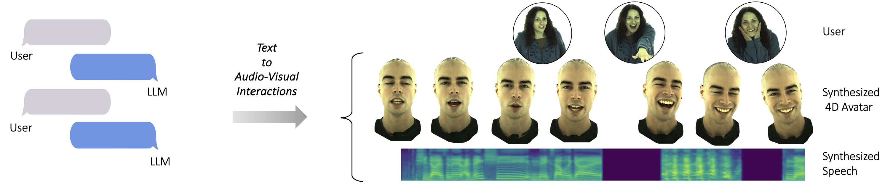

# AV-Flow: Transforming Text to Audio-Visual Human-like Interactions

This is an implementation of AV-Flow.



## Requirements
Install requirements: `pip install -r requirements.txt`

Install DRTK. Follow instructions from: [https://github.com/facebookresearch/DRTK/](https://github.com/facebookresearch/DRTK/)

Install audio2photoreal: [https://github.com/facebookresearch/audio2photoreal/](https://github.com/facebookresearch/audio2photoreal/)

Put audio2photoreal in the same parent directory with this repo, e.g.:
```
    |-- /home/user/repos/
            |-- audio2photoreal/
            |-- avflow/
```


## Dataset
We use 2 datasets in this work.

Download 50h dataset from:

```
    |-- /path/to/dataset/50h_dataset/
            |-- audio/
            |-- expression_codes/
            |-- headpose/
            |-- head_vae/
            |-- wav2vec2_fairseq_base_ls960_asr_ls960_vad100/
            |-- face_topo_small_neck.obj
```
Move `face_topo_small_neck.obj` under `./models/`.


Audio2Photoreal:

Follow instructions from [Audio2Photoreal](https://github.com/facebookresearch/audio2photoreal/) to download their dataset.

We release the ASR tokens and head VAE that we use in our work at:

Place them under each corresponding subject:
```
    |-- /path/to/dataset/audio2photoreal/
            |-- PXB184/
                    |-- scene01_audio.wav
                    |-- scene01_body_pose.npy
                    |-- scene01_face_expression.npy
                    |-- scene01_missing_face_frames.npy
                    |-- ...
                    |-- wav2vec2_fairseq_base_ls960_asr_ls960_vad100/
                            |-- scene01.npy
                            |-- scene02.npy
                            |-- ...
                    |-- head_vae/
                            |-- iter-0500000.pt
```


## Pre-trained Model
We release a pre-trained AV-Flow model for the 50h dataset. Download the pre-trained model from:


## Renderer
The pre-trained personalized renderers are included in the downloaded datasets.
For more details in Codec Avatars, please see the following repos:

[https://github.com/facebookresearch/goliath/](https://github.com/facebookresearch/goliath/)

[https://github.com/facebookresearch/ca_body/](https://github.com/facebookresearch/ca_body/)


## Vocoder
We use a pre-trained BigVGAN vocoder to get the audio signal from the generated spectrograms. We use the base version (bigvgan_base_22khz_80band).
It is included in the downloaded dataset as `./bigvgan_base_22khz_80band/`.

You can also download it from the official repo: [https://github.com/NVIDIA/BigVGAN/](https://github.com/NVIDIA/BigVGAN/).

We also include a fine-tuned version of BigVGAN on the 50h dataset: `./50h_dataset/bigvgan_base_22khz_80band_finetuned`. You can use it by changing the corresponding path under DEFAULT_CONFIG in `recipes/flow_matching_audiovisual.py`.


# Training
The main script for training and inference is `recipes/flow_matching_audiovisual.py`.
It includes a DEFAULT_CONFIG. Change it accordingly with the dataset.

For the 50h dataset, it should be:
```
    DEFAULT_CONFIG = {
        ...
        # dataset name
        "dataset_name": "50h",
        ...
        # dataset config
        "dataset": {
            ...
            "body": False,
            "input_audio_sample_rate": 48000,
            "input_head_dim": 7,
            ...
        },
        ...
    }
```

For the Audio2Photoreal dataset, it should be:
```
    DEFAULT_CONFIG = {
        ...
        # dataset name
        "dataset_name": "Audio2Photoreal",
        "subject": "PXB184",  # subjects: ["PXB184", "RLW104", "TXB805", "GQS883"]
        ...
        # dataset config
        "dataset": {
            ...
            "body": True,
            "input_audio_sample_rate": 48000,
            "input_head_dim": 4,
            ...
        },
        ...
    }
```

Assuming the datasets are stored under `/path/to/dataset/`, the training command is:
```
python recipes/flow_matching_audiovisual.py -i /path/to/dataset/50h_dataset/ -o /path/to/output/dir/av_flow_50h/
```
This will train the basic AV-Flow model on the actor's data. See the "Dyadic Conversations" section for training in the dyadic setting.

Example using Audio2Photoreal dataset:
```
python recipes/flow_matching_audiovisual.py -i /path/to/dataset/audio2photoreal/PXB184/ -o /path/to/output/dir/av_flow_PXB184/
```


# Inference
Inference from audio or text or tokens.

Example:
```
python recipes/flow_matching_audiovisual.py -i /path/to/dataset/50h_dataset/ -o /path/to/output/dir/av_flow_50h/ -c /path/to/output/dir/av_flow_50h/checkpoints/iter-1000000.pth --audio /path/to/audio/filename.wav
```
To infer from audio: `--audio /path/to/audio/filename.wav`

To infer from text: `--text "In the quiet morning, the birds chirp happily, filling the air with their sweet melodies."`

To infer from tokens: `--tokens /path/to/tokens/filename.npy`

The results (3 generated audio samples and corresponding video) are saved under `/path/to/output/dir/results/viz/`.

If audio is provided, we extract tokens using an ASR model (Wav2Vec2). If you want to save the extracted tokens from multiple audio files, you can use the `utils/extract_asr.py`.

If text is provided, we predict tokens from our pre-trained text-to-tokens model.


### Extract tokens from audio
Assuming there are .wav files under `/path/to/audio/`:
```
python utils/extract_asr.py -i /path/to/audio/
```

The extracted tokens are saved as .npy files under `/path/to/audio/wav2vec2_fairseq_base_ls960_asr_ls960/`.

Then you can use the inference command with `--tokens /path/to/audio/wav2vec2_fairseq_base_ls960_asr_ls960/filename.npy`.


# Dyadic Conversations
We additionally provide expression codes and head poses extracted from the monocular video of the participant, using [SMIRK](https://github.com/georgeretsi/smirk/).

The corresponding features are stored under the downloaded dataset: `/path/to/dataset/50h_dataset/participant/`.

To train the model in the dyadic setting (conversations between actor and participant), set the following in the DEFAULT_CONFIG in `recipes/flow_matching_audiovisual.py`:
```
    DEFAULT_CONFIG = {
        ...
        "participant_cond": True,
        "other_dim": 58 + 29,  # 58 SMIRK features and 29 ASR tokens
        ...
    }
```
In this way, the model will be additionally conditioned on the participant's tokens, expressions, and head poses, leading to an always-on avatar that actively listens.

### Inference
Download the participant images from:

Move them under: `/path/to/dataset/50h_dataset/participant/camera01/images/`

To visualize the results, run the following:
```
python recipes/flow_matching_audiovisual.py -i /path/to/dataset/50h_dataset/ -o /path/to/output/dir/av_flow_50h_dyadic/ -c /path/to/output/dir/av_flow_50h_dyadic/checkpoints/iter-1000000.pth --test
```
The results (3 generated audio samples and corresponding videos) are saved under `/path/to/output/dir/test/segment/viz/`.


# License
The code and dataset are released under [CC-NC 4.0 International license](./LICENSE).


# Citation
If you find our work useful, please cite our paper:
```
```


# Acknowledgements
We would like to acknowledge the following repos:

- [Audio2Photoreal](https://github.com/facebookresearch/audio2photoreal/)
- [Goliath](https://github.com/facebookresearch/goliath/)
- [BigVGAN](https://github.com/NVIDIA/BigVGAN/)
- [HiFiGAN](https://github.com/jik876/hifi-gan/)
- [Matcha-TTS](https://github.com/shivammehta25/Matcha-TTS/)
- [SMIRK](https://github.com/georgeretsi/smirk/)

